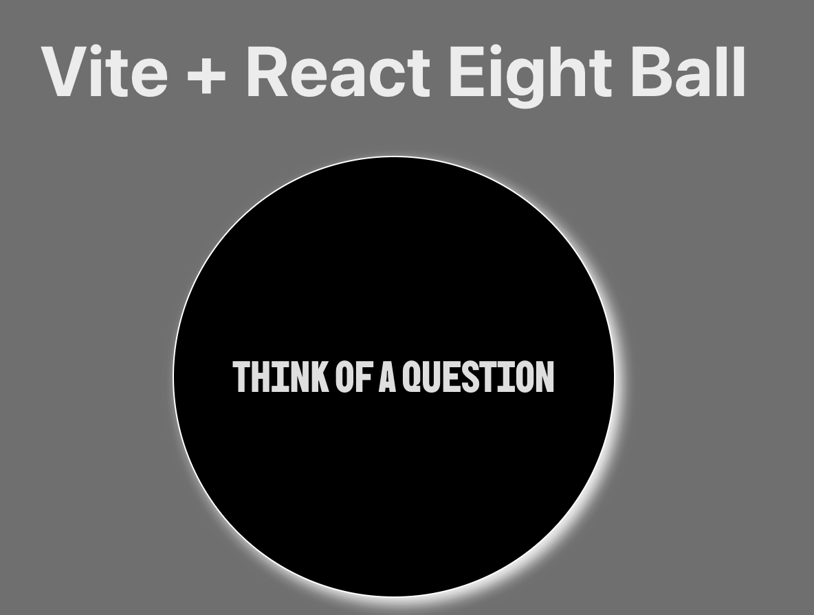
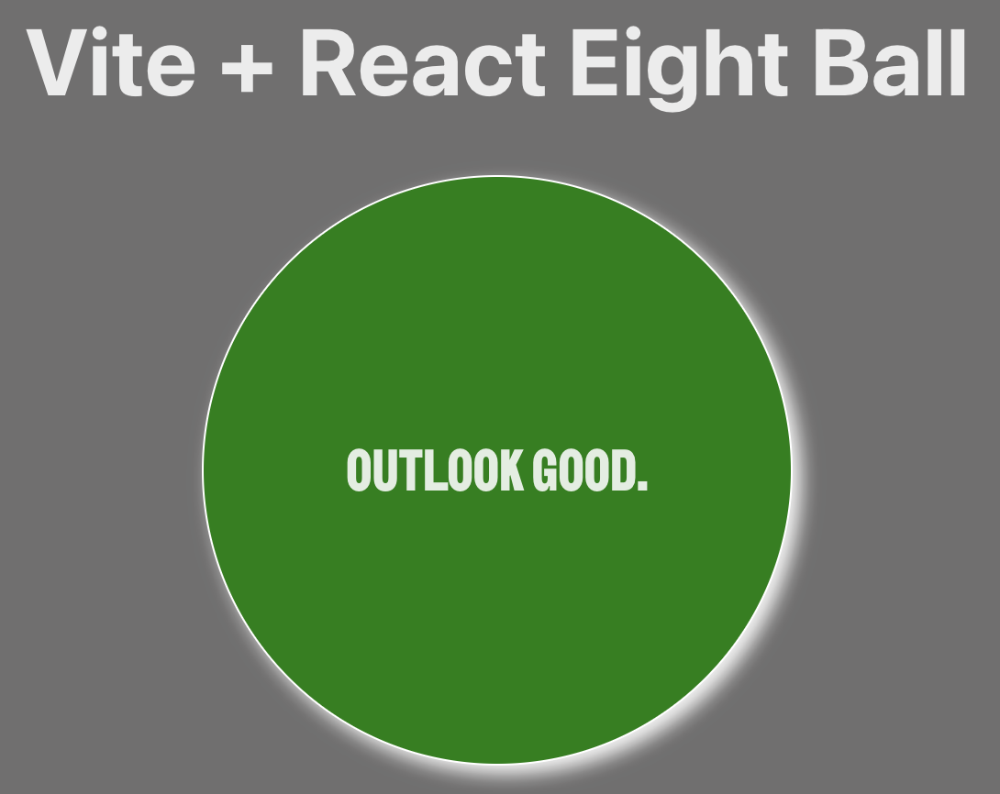
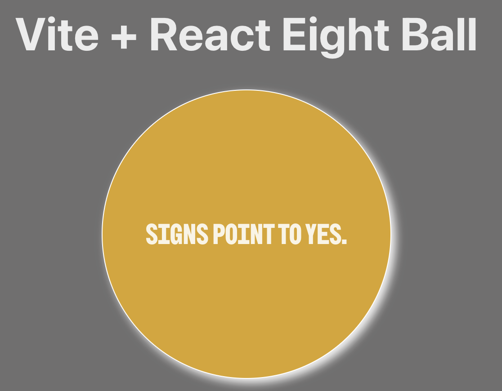

# React + Vite Eight Ball Exercise (bc38-5_EightBall_Exercise)

- [Overview](#overview)
- [React Compiler](#react-compiler)
- [Expanding the ESLint configuration](#expanding-the-eslint-configuration)
- [Installation](#installation)
- [Features](#features)
- [Screenshots](#screenshots)
- [Technologies Used](#technologies-used)
- [Author](#author)
- [Acknowledgments](#acknowledgments)
- [License](#license)

This project is practicing using JSX. It uses the Vite template provides a minimal setup to get React working in Vite with HMR and some ESLint rules.

Currently, two official plugins are available:

- [@vitejs/plugin-react](https://github.com/vitejs/vite-plugin-react/blob/main/packages/plugin-react) uses [Babel](https://babeljs.io/) (or [oxc](https://oxc.rs) when used in [rolldown-vite](https://vite.dev/guide/rolldown)) for Fast Refresh
- [@vitejs/plugin-react-swc](https://github.com/vitejs/vite-plugin-react/blob/main/packages/plugin-react-swc) uses [SWC](https://swc.rs/) for Fast Refresh

## React Compiler

The React Compiler is enabled on this template. See [this documentation](https://react.dev/learn/react-compiler) for more information.

Note: This will impact Vite dev & build performances.

## Expanding the ESLint configuration

If you are developing a production application, we recommend using TypeScript with type-aware lint rules enabled. Check out the [TS template](https://github.com/vitejs/vite/tree/main/packages/create-vite/template-react-ts) for information on how to integrate TypeScript and [`typescript-eslint`](https://typescript-eslint.io) in your project.

## Installation
1. Clone the repository:

   ```bash
   git clone
    ```
2. Navigate to the project directory:
    ```bash
    cd eight-ball-exercise
    ``` 
3. Install the dependencies:
    ```bash
    npm install
    ```
4. Start the development server:
    ```bash
    npm run dev
    ``` 
5. Open your browser and go to `http://localhost` to see the application running.

## Overview
This project is a simple React application that simulates a Magic Eight Ball. Users can click on the ball to receive random answers to their questions. The application uses React's state management to update the ball's message and color based on predefined responses.

## Features
- Clickable Magic Eight Ball that provides random answers.
- Dynamic message and color changes based on the response.
- Easy to understand and modify React component structure.

## Screenshots





## Technologies Used
- React
- Vite
- JavaScript (ES6+)
- CSS

## Author
- Github - [TechEdDan2](https://github.com/TechEdDan2)
- Frontend Mentor - [@TechEdDan2](https://www.frontendmentor.io/profile/TechEdDan2)

## Acknowledgments
The YouTubers and other educational resources I have been learning from include: Coder Coder (Jessica Chan), BringYourOwnLaptop (Daniel Walter Scott), Kevin Powell, vairous Udemy courses, Geeks for Geeks, Stack Overflow, and Stony Brook University's Software Engineering Bootcamp (curriculum developed by Colt Steele) 

## License
This project is licensed under the ISC license
